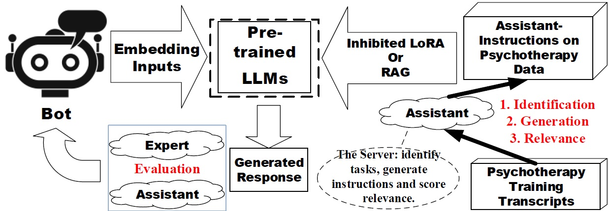
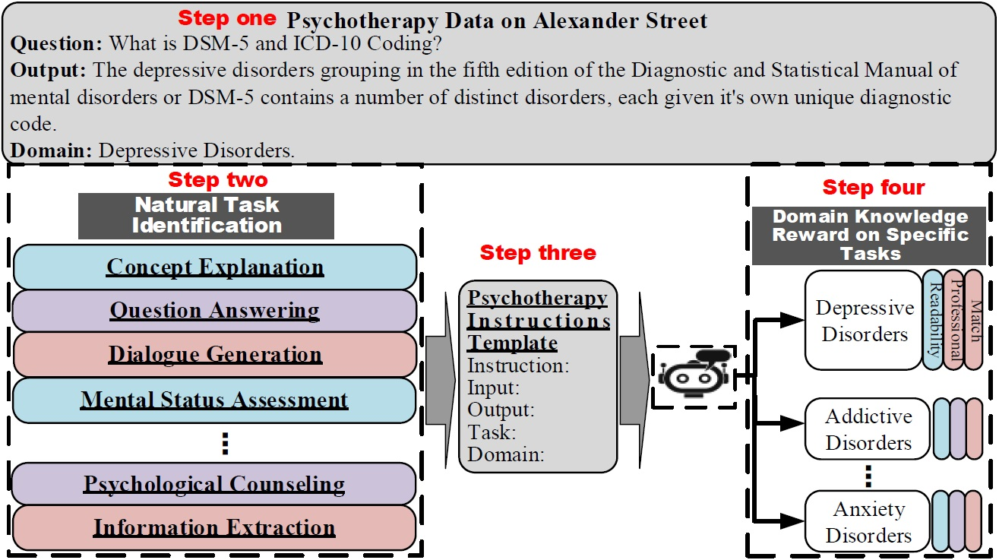
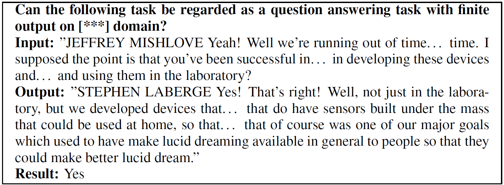

# Psychotherapy Assistant Instruction


[](LICENSE)
[](https://arxiv.org/abs/2404.16160)

In this project, we aim to provide **Assistant Instruction** to traditional psychiatric and counseling services by using large language models (LLMs). An effectively psychotherapy treatment heavily relies on the experience and professional knowledge of psychologists. However, the psychotherapy knowledge of LLMs should be improved. 

This open-source repo introduce the Assistant Instruct-tuned LLMs that has been fine-tuned with psychotherapy domian instruction data. In building our instructional tuning dataset, we sourced genuine counseling dialogues from [Alexander Street](https://alexanderstreet.com/) and utilized GPT-4 as a helper to refine and organize the raw data. Moreover, we devised a thorough suite of metrics designed specifically for the Psychotherapy Counseling field. These metrics facilitate the evaluation of proficiency in crafting language content that encompasses various counseling skills. The simplified workflow is depicted below:

<div align="center">
  <figure>
    
  </figure>
</div>

# Updates
- [2024-04-25] The second version of [Psychotherapy Data](https://drive.google.com/file/d/1N1UoRLHFEF2DcE2q3421FT08JV7r8Lqf/view?usp=sharing) revised by GPT-4.
- [2024-02-28] Our paper ["Domain-Specific Improvement on Psychotherapy Chatbot Using Assistant"](https://arxiv.org/abs/2404.16160) has been accepted by ICASSP 2024 Workshop EIHRC - [Presentation](/assets/ICASSP2024_Presentation.pdf).
- [2023-11-08] First release of Psychotherapy Assistant Instruction. We opened source codes and Assistant Instruction tuned models with psychotherapy domian instruction data.
- [2023-05-12] First release of Alexander Street counselling data, very appreciate that you have used our data [- Google Drive](https://drive.google.com/file/d/1x4bP9G9_kfTr80RiScdVxE6sRbF2myMw/view?usp=sharing).

# Quick Start
## ⚙️ Install
Our repo mainly constructed based on [Langchain](https://github.com/langchain-ai/langchain), [PEFT](https://github.com/huggingface/peft) and [SelfRAG](https://github.com/AkariAsai/self-rag). Or you can install from source by
```bash
git clone https://github.com/ChengKang520/psychotherapy-assistant_instruction.git
cd Psych_BioGPT
pip install -r requirements.txt
pip install -e /peft-0.10.0
```


## 🚀 Inference


### Inference with LoRA fine-tuned models 

#### Serving with Web GUI

```bash
#!/bin/sh
#SBATCH --partition=amdgpu
#SBATCH --time=24:00:00
#SBATCH --gres=gpu:1
#SBATCH --ntasks-per-node=1 # tasks per node
#SBATCH --mem-per-gpu=40000
#SBATCH --job-name=chatglm1_FT
#SBATCH --err=chatglm1_InA_20epoch.err
#SBATCH --out=chatglm1_InA_20epoch.out
#SBATCH --mail-type=ALL              # what to sen  d, valid type values are NONE, BEGIN, END, FAIL, REQUEUE, ALL

/bin/hostnamesbatch
srun -l /bin/hostname
srun -l /bin/pwd

ml Python/3.10.4-GCCcore-11.3.0
ml CUDA/11.7.0
source /home/kangchen/Chatbot/Psych_BioGPT/EnvLlama/bin/activate
cd /home/kangchen/Chatbot/Psych_BioGPT/

CUDA_VISIBLE_DEVICES=0 python finetune/finetune.py \
--base_model /home/kangchen/Chatbot/Psych_BioGPT/models/input/chatglm/chatglm-6b/ \
--model_type "chatglm" \
--data_dir datasets/psychtherapy_data.json \
--output_dir finetuned/chatglm-6b_psychtherapy_20Epochs_InA \
--num_epochs 20 \
--learning_rate 0.001 \
--batch_size 256 \
--micro_batch_size 16

cd /home/kangchen/Chatbot/Psych_BioGPT/serve/
python api.py
```

### Inference with the RAG method


```
### Inference with RAG

import os
import torch
from transformers import (
    AutoModelForCausalLM,
    AutoTokenizer,
    BitsAndBytesConfig,
    pipeline
)
from datasets import load_dataset
from peft import LoraConfig, PeftModel

from langchain.text_splitter import CharacterTextSplitter
from langchain.document_transformers import Html2TextTransformer
from langchain.document_loaders import AsyncChromiumLoader


from langchain.embeddings.huggingface import HuggingFaceEmbeddings
from langchain.text_splitter import RecursiveCharacterTextSplitter
from langchain.vectorstores import FAISS
from langchain.document_loaders import DirectoryLoader
from langchain.document_loaders import PyPDFLoader
from langchain.document_loaders import TextLoader
from langchain.document_loaders import JSONLoader
from langchain.prompts import PromptTemplate
from langchain.schema.runnable import RunnablePassthrough
from langchain_community.llms import HuggingFacePipeline
from langchain.chains import LLMChain
import nest_asyncio
nest_asyncio.apply()

#################################################################
# Tokenizer
#################################################################

model_name = 'mistralai/Mistral-7B-Instruct-v0.1'

tokenizer = AutoTokenizer.from_pretrained(model_name, trust_remote_code=True)
tokenizer.pad_token = tokenizer.eos_token
tokenizer.padding_side = "right"

#################################################################
# bitsandbytes parameters
#################################################################

# Activate 4-bit precision base model loading
use_4bit = True

# Compute dtype for 4-bit base models
bnb_4bit_compute_dtype = "float16"

# Quantization type (fp4 or nf4)
bnb_4bit_quant_type = "nf4"

# Activate nested quantization for 4-bit base models (double quantization)
use_nested_quant = False

#################################################################
# Set up quantization config
#################################################################
compute_dtype = getattr(torch, bnb_4bit_compute_dtype)

bnb_config = BitsAndBytesConfig(
    load_in_4bit=use_4bit,
    bnb_4bit_quant_type=bnb_4bit_quant_type,
    bnb_4bit_compute_dtype=compute_dtype,
    bnb_4bit_use_double_quant=use_nested_quant,
)

# Check GPU compatibility with bfloat16
if compute_dtype == torch.float16 and use_4bit:
    major, _ = torch.cuda.get_device_capability()
    if major >= 8:
        print("=" * 80)
        print("Your GPU supports bfloat16: accelerate training with bf16=True")
        print("=" * 80)

#################################################################
# Load pre-trained config
#################################################################
model = AutoModelForCausalLM.from_pretrained(
    model_name,
    quantization_config=bnb_config,
)


def print_number_of_trainable_model_parameters(model):
    trainable_model_params = 0
    all_model_params = 0
    for _, param in model.named_parameters():
        all_model_params += param.numel()
        if param.requires_grad:
            trainable_model_params += param.numel()
    return f"trainable model parameters: {trainable_model_params}\nall model parameters: {all_model_params}\npercentage of trainable model parameters: {100 * trainable_model_params / all_model_params:.2f}%"

print(print_number_of_trainable_model_parameters(model))


text_generation_pipeline = pipeline(
    model=model,
    tokenizer=tokenizer,
    task="text-generation",
    temperature=0.2,
    repetition_penalty=1.1,
    return_full_text=True,
    max_new_tokens=1000,
)

mistral_llm = HuggingFacePipeline(pipeline=text_generation_pipeline)


############   TEXT files loader   ###########
# loader = DirectoryLoader('data/CTV_data/', glob="*.txt", loader_cls=TextLoader)

# ############   PDF files loader   ###########
# loader = DirectoryLoader('output/', glob="*.pdf", loader_cls=PyPDFLoader)

############   JSON files loader   ###########
loader = DirectoryLoader('data/CTV_json_chatgpt/', glob="*.txt", loader_cls=JSONLoader)

documents = loader.load()

#splitting the text into
text_splitter = RecursiveCharacterTextSplitter(chunk_size=512, chunk_overlap=158)
chunked_documents = text_splitter.split_documents(documents)

retriever = db.as_retriever()

prompt_template = """
### [INST] Instruction: Answer the question based on your psychotherapy knowledge. Here is context to help:

{context}

### QUESTION:
{question} [/INST]
 """

# Create prompt from prompt template
prompt = PromptTemplate(
    input_variables=["context", "question"],
    template=prompt_template,
)

# Create llm chain
llm_chain = LLMChain(llm=mistral_llm, prompt=prompt)

# *********************************************** data
evaluation_file = 'results/Input_List.txt'

with open(os.path.join(evaluation_file), "r", encoding="UTF-8") as f:
    evaluation_samples = f.read().split('\n')


for i_evaluation in range(len(evaluation_samples)):
    questions = evaluation_samples[i_evaluation]
    # questions = "What is Depression Behavioral Activation and Cognitive Change？"
    ############   Original   ###########

    original_result = llm_chain.invoke({"context": "", "question": questions})
    # print("RAG text: " + original_result['text'])
    print("*******************************************************")
    # print(original_result)
    print("Original output: " + original_result['text'])


    ############   RAG   ###########
    rag_chain = ({"context": retriever, "question": RunnablePassthrough()} | llm_chain)
    rag_result = rag_chain.invoke(questions)
    print("*******************************************************")
    # print(rag_result)
    print("RAG output: " + rag_result['text'])

```


# Data

To improve the professional knowledge of LLMs on psychotherapy domains, our paper presents the psychotherapy Assistant-Instruction approach, which aims to (1) achieve generalization over different psychological consulting tasks and (2) incorporate psychological knowledge into natural common LLMs. Bellow Figure is our proposed approach.

<div align="center">
  <figure>
    
  </figure>
</div>


### Data Source

Data can be downloaded from  this repo.

Alexander Street Press is a website known for its vast collection of video transcripts and recordings from therapy and counseling sessions, covering topics such as depression, abuse, trauma, and mental disorders. The video transcript dataset was specifically collected from the Counseling and Therapy channel on the website. We curated the dataset to include only English-language sessions recorded between 1980 and 2023, resulting in a set of 1,333 videos and accompanying transcripts. After filtering out short-length and non-informative videos, the final dataset comprises 1,179 video transcripts, containing a total of 188,421 dialogue turns. To ensure data quality, we performed a cleaning process to remove Unicode characters, pauses, and other unnecessary elements, resulting in a dataset with 3,141,520 words and a vocabulary size of 30,438.1

To arrange psychotherapy data to correct tasks, such as (1) concept explanation, (2) question answering, (3) mental status assessment, (4) psychological counseling and (5) information extraction, (6) dialogue generation, (7) sentiment analysis, (8) event ordering, we use an assistant LLM – GPT-4 to identify which task the human-constructed instruction should be. We directly prompt the LLM in a few-shot way to determine this, using 8 classification instructions from the seed tasks. The prompting template is shown in the bellow Table.


<div align="center">
    <figure>
        
    </figure>
</div>


### Data Processing

To build the dataset, we took the following steps:

1. **Transcription:** The counseling recordings were obtained from the internet.

2. **Data Cleaning & Information Extraction:** Using GPT-4 as an Assistant, the transcripts were cleaned to remove any irrelevant or sensitive information, to ensure that the data used for training and testing maintains privacy and ethical standards. 

3. **Task Identification:** Because we do not know the task from the original psychotherapy data, the assistant - LLMs was used to automatically recognize the task type of inout content. Each short conversation text was identified by GPT-4 according to the understanding of GPT-4 itself. Tasks covered include: (1) *concept explanation*, (2) *question answering*, (3) *mental status assessment*, (4) *psychological counseling*, (5) *information extraction*, (6) *dialogue generation*, (7) *sentiment analysis*, (8) *event ordering*.

4. **Modifying Data:** According to the general knowledge of GPT-4, the original psychotherapy data will be revised, but meanwhile, the professional psychotherapy knowledge also will be remained to avoid psychotherapy experience missing. 

5. **Decision:** Using the knowledge of GPT-4, the revised psychotherapy instruction data will be evaluated to identify if the result is acceptable.
```
    "success_prompt": (
        "Given an instruction, an input, an output, a task type and a domain, please rate and evaluate all content from 0 (lowest) - 5 (highest). The detailed criterion is as follows: "
        "5: The data format provides a complete, highly detailed, and informative response to the query, fully satisfying the information needs. "
        "4: The data format mostly fulfills the need in the query, while there can be some minor improvements such as discussing more detailed information, having better structure of the response, or improving coherence. "
        "3: The data format is acceptable, but some major additions or improvements are needed to satisfy users’ needs. "
        "2: The data format still addresses the main request, but it is not complete or not relevant to the query. "
        "1: The data format is barely on-topic or completely irrelevant."
        "0: To be determined."
    ),
```


# Evaluation
Here is the comparison between the performance of our chatbot and other large language models. The evaluation is based on six counseling skills and overall performance, and our chatbot demonstrates a better performance in most of these categories. 


## Metrics of Automatic Evaluation

The evaluation metrics are derived from the following categories:
1. **Perplexity**: Perplexity is an evaluation metric that measures the quality of language models. In this repo, we used the popular model GPT2.
2. **ROUGHE-L**: This metric evaluates the match of the longest common subsequence of words between the two texts. The words do not need to be in the exact same order..


## Metrics of Human Evaluation

The evaluation metrics are derived from the following categories:
1. **Information Readability**: Measures the readability of LLMs on psychological knowledge to avoid the "Hallucination ".
2. **Knowledge Professional**: Evaluates the prefessional psychotherapy knowledge of fine-tuned LLMs on each domains.
3. **Domain Match**: Assesses the LLM's capacity to concentrate on the same topic. 


For the human evaluation, we also submit 60 generated outputs (20 examples for each tasks, as we have 3 main tasks) without model and domain information to two professional psychologists, and based on their professional psychotherapy knowledge, they will measure the quality of the generated content according to the questions and answers. There are six grades that they will use to mark the quality of generated content: Extremely  Bad ($1$), Bad ($2$), Neutral ($3$), Acceptable ($4$), Good ($5$) and Very Good ($6$). They should consider the readability, professional and match score (that measures the match with the domain knowledge).

See [Evaluation Results](evaluation/ReadMe.txt) for details on the metrics' definition and examples.


### Human Evaluation Agreement
We used Cohen's $\kappa$ to measure inter-rater agreement for categorical items. The 6-level rating scale (ranging from $1$ to $6$) was treated as a categorical variable for each aspect under consideration. The resulting $\kappa$ value was $0.63$, indicating a moderate level of agreement according to common practice. Furthermore, we computed the Spearman correlation coefficient $\rho$ between the ratings of our two evaluators, treating the ratings as ordinal variables (ranging from $1$ to $6$). The obtained coefficient was $\rho = 0.81$, demonstrating a high correlation between the two evaluators. These results indicate a reasonably reliable human evaluation process for our study.

# Citation
If you use the data or code from this project, please cite the reference:
```
@INPROCEEDINGS{10626529,
  author={Kang, Cheng and Novak, Daniel and Urbanova, Katerina and Cheng, Yuqing and Hu, Yong},
  booktitle={2024 IEEE International Conference on Acoustics, Speech, and Signal Processing Workshops (ICASSPW)}, 
  title={Domain-Specific Improvement on Psychotherapy Chatbot Using Assistant}, 
  year={2024},
  volume={},
  number={},
  pages={351-355},
  keywords={Large language models;Conferences;Medical treatment;Oral communication;Speech enhancement;Signal processing;Linguistics;Assistant-Instruction;Psychotherapy Chatbot;Large Language Model;Adaption Fine-tuning;Knowledge Retrieval;Parameter Efficient Fine-Tuning},
  doi={10.1109/ICASSPW62465.2024.10626529}}
