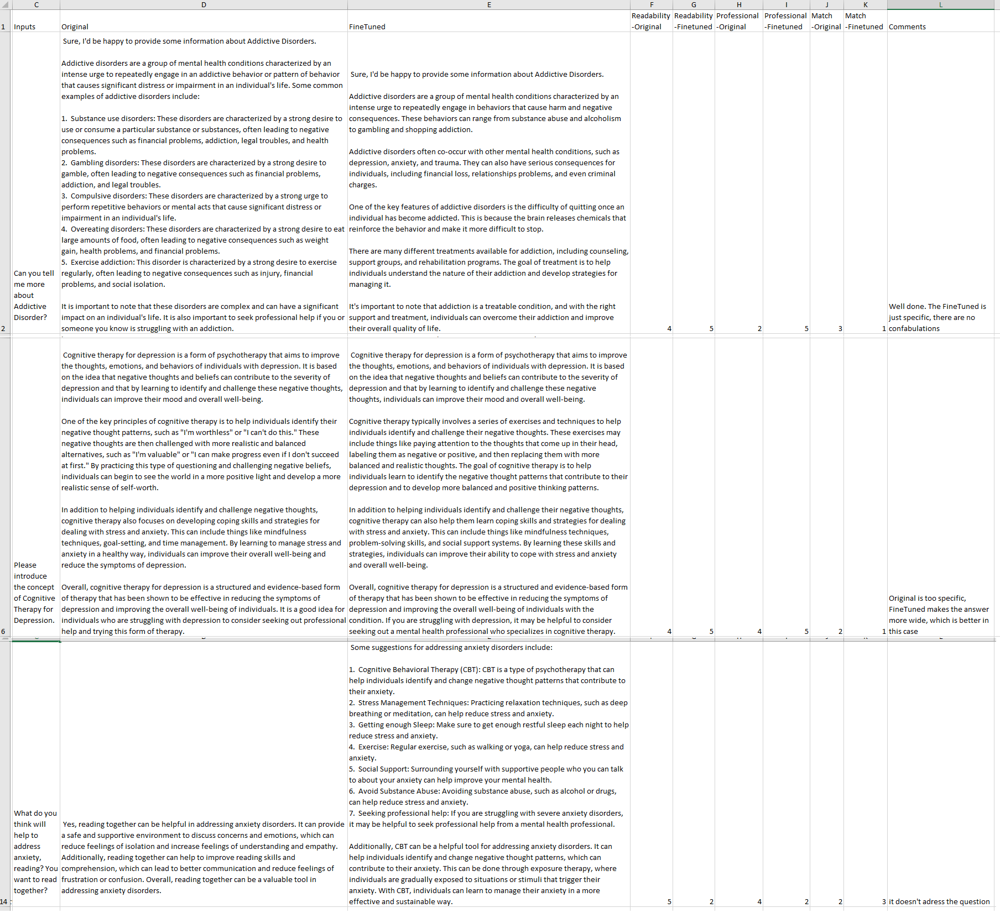
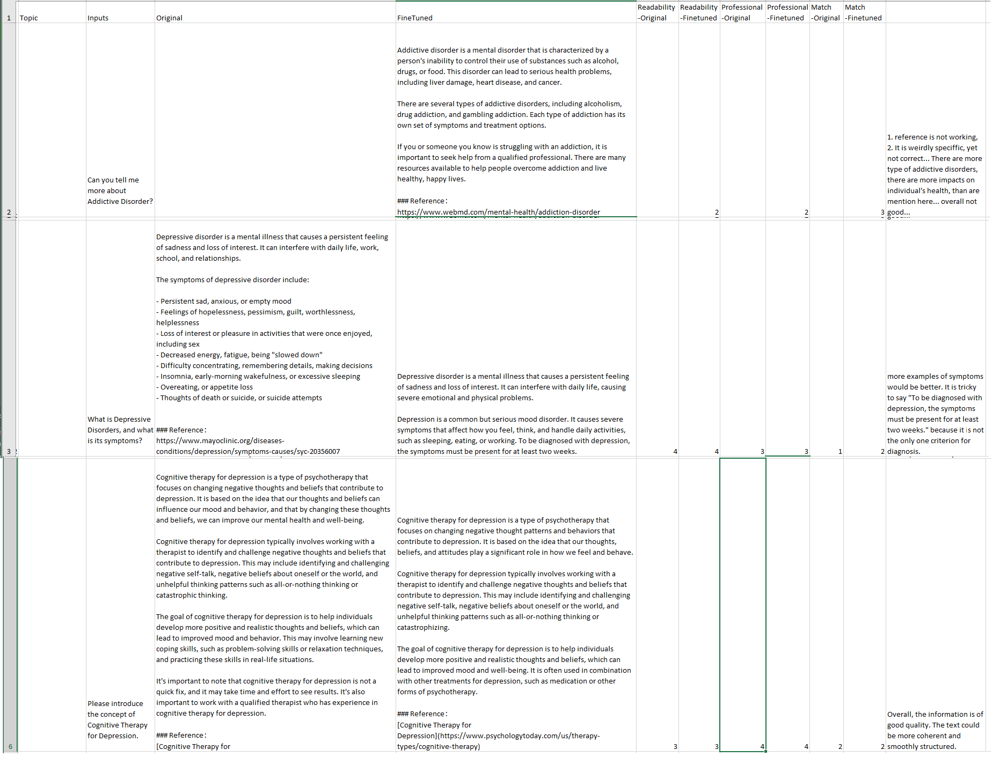

# Evaluation
Here is the comparison between the performance of our chatbot and other large language models. The evaluation is based on six counseling skills and overall performance, and our chatbot demonstrates a better performance in most of these categories. 

## Metrics of Automatic Evaluation

The evaluation metrics are derived from the following categories:
1. **LMentry**: Generating a sentence containing specific words, identifying which words in a list belong to a specific category.
2. **Perplexity**: Perplexity is an evaluation metric that measures the quality of language models. In this repo, we used the popular model GPT2.
3. **ROUGHE-L**: This metric evaluates the match of the longest common subsequence of words between the two texts. The words do not need to be in the exact same order..

## Metrics of Human Evaluation

The evaluation metrics are derived from the following categories:
1. **Information Readability**: Measures the readability of LLMs on psychological knowledge to avoid the "Hallucination ".
2. **Knowledge Professional**: Evaluates the prefessional psychotherapy knowledge of fine-tuned LLMs on each domains.
3. **Domain Match**: Assesses the LLM's capacity to concentrate on the same topic. 

####  Human Evaluation on the output of ChatGLM2-6B

    <figure>
        
    </figure>

####  Human Evaluation on the output of Llama2-7B

    <figure>
        
    </figure>

